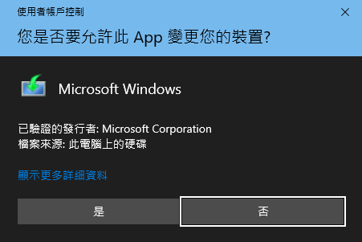
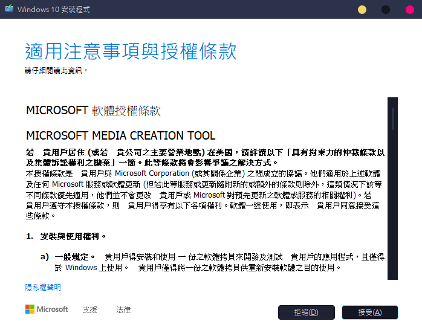
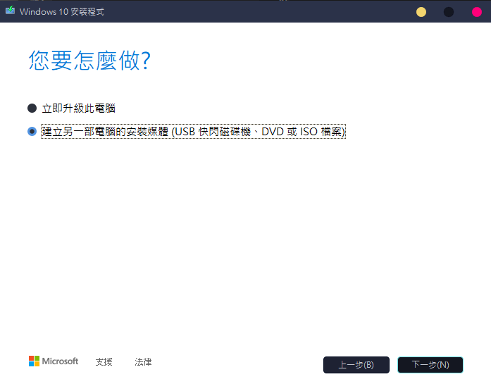
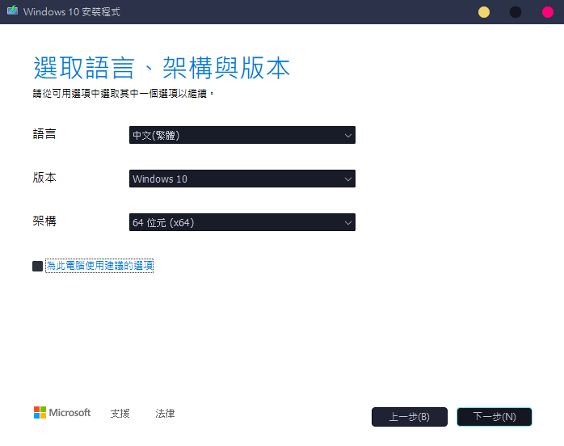
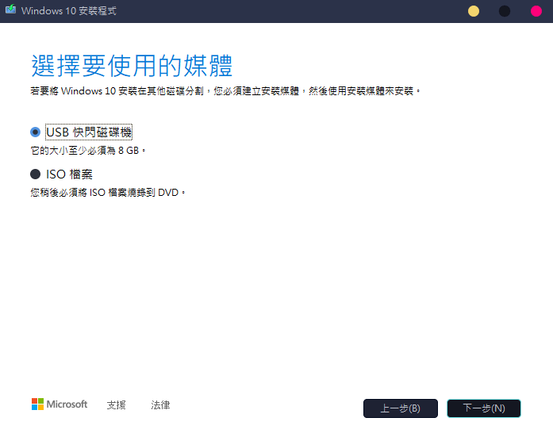
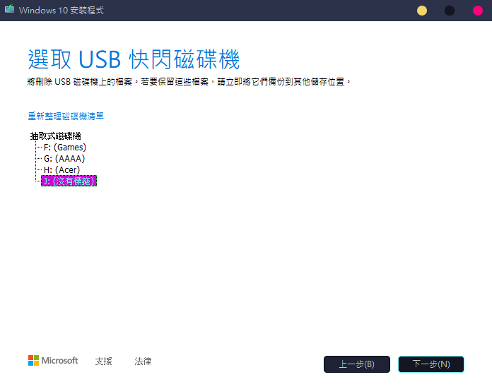
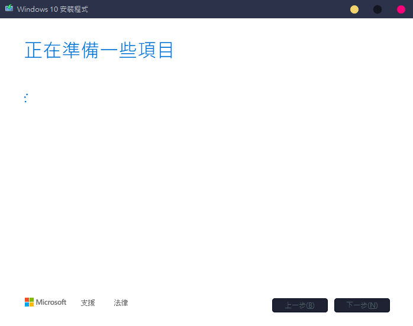
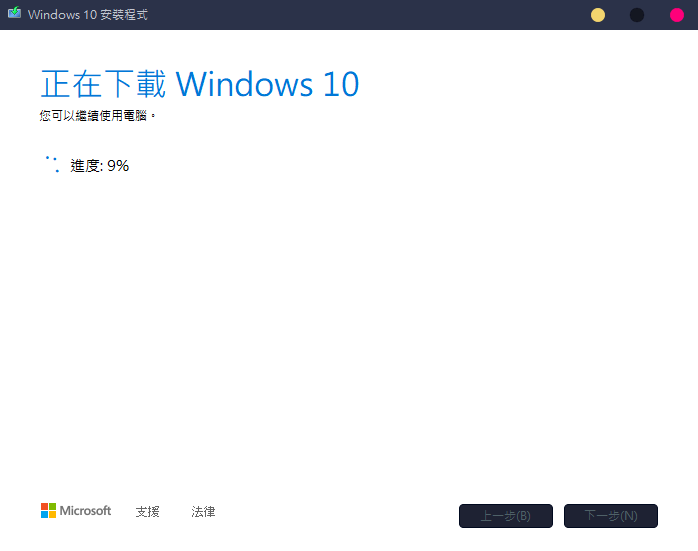
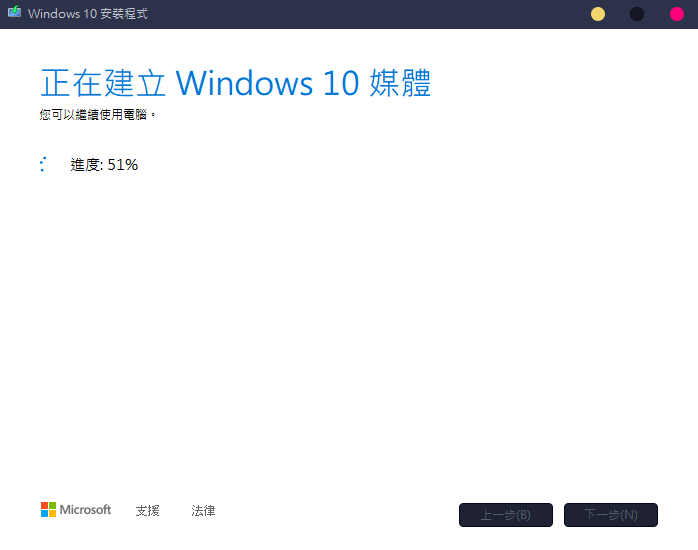

# How To Create Installation Media for Windows 10
## 如何製作一個 Windows 10 重灌隨身碟

# Index
+ 第一種方法
  + [使用安裝媒體製作工具](#1.使用安裝媒體製作工具 "點我跳轉到這個章節")
+ 第二種方法
  + [使用 iso 映像檔](#2.使用-iso-映像檔 "點我跳轉到這個章節")

---

# 1.使用安裝媒體製作工具
> 準備物品:
> + 有網路連線的電腦
> + 一支 ***空的*** 隨身碟 (容量大於8GB為佳)
> + Microsoft 提供的安裝媒體製作工具
>   + 下載連結: [安裝媒體製作工具](https://go.microsoft.com/fwlink/?LinkId=691209 "點我從官網下載")

### 等待工具下載完成，打開後首先會看到這個畫面，選擇 `是` ，~~你想選擇 `否` 我也沒意見~~

### 接下來會出現這個畫面，選擇 `接受` ，~~有耐心的人可以全部看完~~

### 選擇第二項 `建立另一部電腦的安裝媒體`

### 取消勾選 `為此電腦使用建議的選項` ，這一步是為了取得完整的安裝檔，接下來點選 `下一步`

### 選擇 `下一步`

## *接下來這一步請* ***一定 一定 一定*** *要注意，如選擇錯誤，會導致隨身碟資料被刪除 !!!*

### 再來就是 漫~長~ 的等待 OwO

### 等待過程中可以喝杯茶或是看點影片打發時間
> 找不到好看的也可以看我的推薦影片: [NVEDIA 洩漏 RTX 4090 推出時間? 日期居然與"他"有關係?](https://www.youtube.com/watch?v=dQw4w9WgXcQ)

### 選擇 `完成`，會自動退出安裝程式

# 2.使用 iso 映像檔